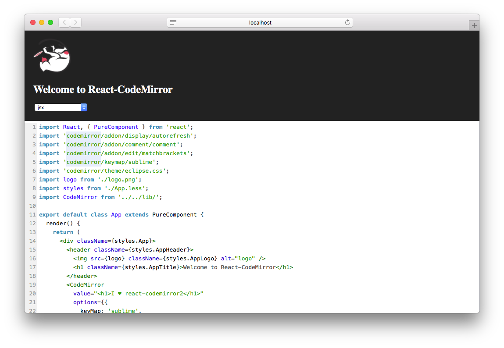

react-codemirror
===

CodeMirror component for React. demo @[uiw-react.github.io/react-codemirror/](https://uiw-react.github.io/react-codemirror/)



## Install

```bash
npm install @uiw/react-codemirror --save
```

## Usage

```jsx
import CodeMirror from '@uiw/react-codemirror';
import 'codemirror/keymap/sublime';
import 'codemirror/theme/eclipse.css';

<CodeMirror
  value={code}
  options={{
    keyMap: 'sublime',
    mode: 'jsx',
  }}
/>
```

## License

Licensed under the MIT License.
